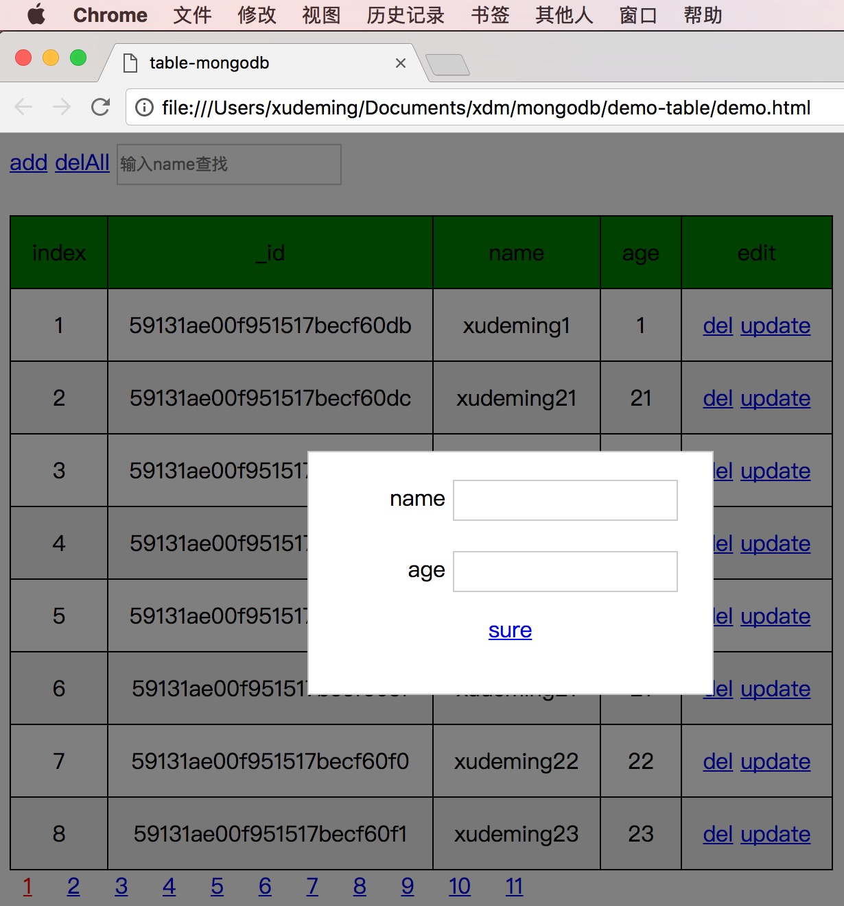

# mongodb
	- 用mongodb做的表格的例子；
	- 包含：增加、删除、更改、查找、分页；

## 项目截图



## 用法：
	- 主要分为俩部分操作：
	1. 搭建数据库
	2. 用node操作数据库（基于mongoose）
#### 搭建数据库：
	- 先搭建好数据库，并插入数据、启动数据库
	- mongodb的可视化工具推荐robomongo
1. 安装mongodb => `brew install mongodb`
2. 创建数据存储目录 => `mkdir -p ~/Documents/mongodb/data`
3. 修改mongodb配置文件 => `vi /usr/local/etc/mongod.conf`，如：

	```
	systemLog:
	  destination: file
	  path: /usr/local/var/log/mongodb/mongo.log
	  logAppend: true
	storage:
	  dbPath: /Users/xudeming/Documents/xdm/mongodb/data
	net:
	  bindIp: 127.0.0.1
	  port: 27017
	processManagement:
	  fork: true
	```
	- fork代表在后台启动mongod进程，各种配置选项参考：https://docs.mongodb.com/manual/reference/;
	- dbPath代表数据的存储路径;
	
4. 启动mongodb服务器端 => `npm start`
	- 可以打开浏览器http://127.0.0.1:27017/ 看是否启动成功
	- 要停止mongodb可以：`sudo pkill -9 mongod`
	- 如果出现错误**child process failed, exited with error number 100**，先`sudo pkill -9 mongod`
5. 启动mongodb后，就可以创建数据库了 

	```
	=> `mongo`进入mongodb cli 
	=> `show dbs`查看数据库
	=> `use demo`创建demo数据库 
	=> `show tables`查看此数据库的表
	=> `db.createCollection('Users')`在demo数据库中创建Users表 
	=> `for(var i=1;i<100;i++){db.Users.insert({name:'xudeming'+i,age:i})}`向表中添加数据
	=> `db.Users.find()`查看插入数据是否成功
	=> 退出命令行
	```
	
	- mongod为mongodb的服务端，mongo为客户端
	- http://www.cnblogs.com/eggTwo/p/4040580.html
	
#### 用node操作数据库（基于mongoose）
	- 数据库准备好后，就可以用node操作了
1. `npm install`
2. `cd demo-table`
3. `node node.js`
4. 浏览器打开页面


## 参考资料
	- mongodb数据库:
		1. https://www.mongodb.com/
		2. http://www.cnblogs.com/huangxincheng/archive/2012/02/18/2356595.html
		3. http://www.jianshu.com/p/a0c3ae2555a0
		4. http://www.cnblogs.com/libingql/archive/2011/06/09/2076440.html
		5. http://www.ttlsa.com/mongodb/mongodb-remove-data/
	- mongodb npm
		1. https://www.npmjs.com/package/mongodb
		2. http://mongodb.github.io/node-mongodb-native/2.2/api/
		3. http://www.jb51.net/article/59822.htm
	- mongoose(依赖npm mongodb):
		1. http://www.nodeclass.com/api/mongoose.html#quick_start
		2. http://ourjs.com/detail/53ad24edb984bb4659000013
		3. http://www.cnblogs.com/zhongweiv/p/mongoose.html
